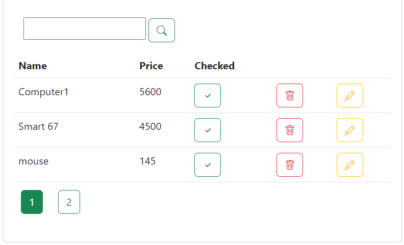
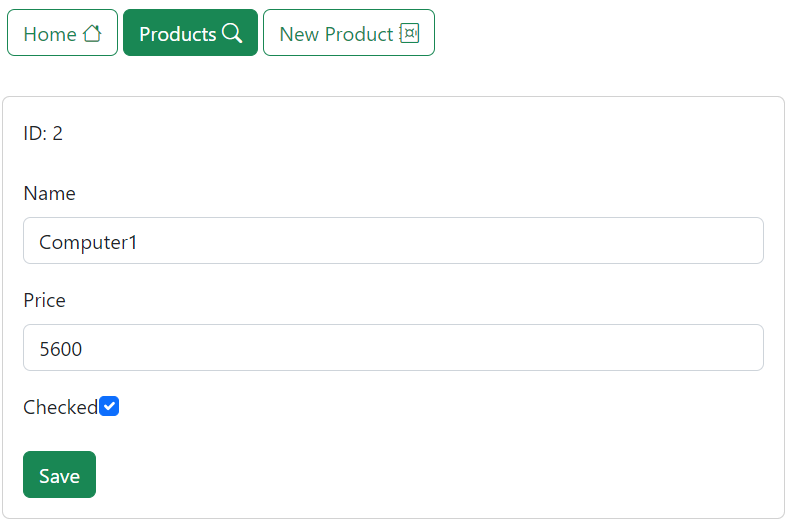

### Angular App Demo

   
<p>Steps which we will follow in this demo :</p>
<ul>
<li>install json server library   and added data to db.json.

```shell
    # create a new Gatsby site using the minimal starter
    npm install --save  json-server
```
</li>
<li>create a service layer which we will create api that interact with backend.

</li>
<li>Create Product Model Type.

</li>
<li>create a Home Component which will display just HomeComponent label.

</li>
<li>Display navbar in the root of the project in our AppComponent.

</li>
<li>Create Products Component to display products list.

</li>
<li>Create New Products Component to Add product.

</li>
<li>Create Edit Products Component to Edit product.

</li>
</ul>


